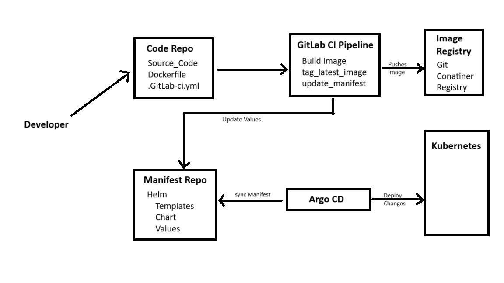

# DevOps Internship Assignment - AI Planet
## Overview
Hello! My name is Ankush Singh and this repo is specifically made for the DevOps Internship Assignment by AI Planet.

This repo contains the kubernetes and Argo manifestaions, including ArgoCD Application file and Argo Rollouts YAML file. Up next is the step-by-step walkthrough of how I implemented the GitOps deployment pipeline using ArgoCD and Argo Rollouts for advance deployment strategies, namely Canary release.


## Tasks to be Performed
- ### [Task 1](#toolbox-getting-started)
  - Create a GitRepository: Create a Github repository and host your source code in the same repository.
  - Install Argo CD on Your Kubernetes Cluster: Follow the official Argo CD documentation to install and set up Argo CD.
  - Install Argo Rollouts: Install the Argo Rollouts controller in your Kubernetes cluster, following the official guide.
- ### [Task 2](#toolbox-getting-started)
  - Dockerize the Application: Build a Docker image for the web application of your choice and push it to a public container registry of your choice.
  - Deploy the Application Using Argo CD:
  - Modify the Kubernetes manifests in your forked repository to use the Docker image you pushed.
  - Set up Argo CD to monitor your repository and automatically deploy changes to your Kubernetes cluster.
- ### [Task 3](#toolbox-getting-started)
  - Define a Rollout Strategy: Modify the application's deployment to use Argo Rollouts, specifying a canary release strategy in the rollout definition.
  - Trigger a Rollout: Make a change to the application, update the Docker image, push the new version to your registry, and update the rollout definition to use this new image.
  - Monitor the Rollout: Use Argo Rollouts to monitor the deployment of the new version, ensuring the canary release successfully completes.
- ### [Task 4](#toolbox-getting-started)
  - Document the Process: Write a summary of the steps you took, including any challenges you encountered and how you resolved them.
  - Clean Up: Describe how to cleanly remove all resources created during this assignment from the Kubernetes cluster.
 
# WorkFlow


Soory For the irregular shapes in flowchart, I was in hurry (Finals exam are going on)

<!-- Task 1 -->
# Task 1: Setup and Configuration
The project involves setting up a GitOps pipeline to automate the deployment and management of a simple web application. utilizing Argo CD for continuous deployment and Argo Rollouts for advanced deployment strategies within a Kubernetes environment.
and
We are going to do the whol Project using VM's and GitOPs Concepts

### Creating an EC2 instance in AWS Console and Installing Dependencies
Specification
- Image: Ubuntu 22.04
- Type: t2,large (We are going to run Argocd, Argo rollout, Docker and Minikube on it)
- Create a key pair
- Storage: 25 GB
- [Install Docker and Minikube](https://github.com/aankusshh/AI_planet_Devops/tree/main/MinikubeInstallation.md)
- Install ArdoCD
  ```
  kubectl create namespace argocd
  kubectl apply -n argocd -f https://raw.githubusercontent.com/argoproj/argo-cd/stable/manifests/install.yaml
  ```
  It will Create a namespace -> argocd
  and install dependencies for argocd
  ### Retrieving Password
  ```
  kubectl -n argocd get secret argocd-initial-admin-secret -o jsonpath="{.data.password}" | base64 -d

  username: admin
  password: will be retrived from above code
  ```
  ### Tunneling Route
  ```
  kubectl port-forward svc/argocd-server -n argocd --address 0.0.0.0 8080:443
  ```
  Now, we can access the ArgoCD via <InstanceIP>:8080

- Install ArgoRollout
  ```
  kubectl create namespace argo-rollouts
  kubectl apply -n argo-rollouts -f https://github.com/argoproj/argo-rollouts/releases/latest/download/install.yaml
  ```
  It will Create a namespace -> argo-rollouts
  and install dependencies for argocd

## Setting Up GITLAB or GITHUB
For this project we are using GitLab for following purpose:
- For storing code (Use as repository)
- For Making CICD Pipeline (or we can say perticularly CI pipeline, CD we will do with ArgCD)
  we can aslo use the jenkins for the same purpose, but I thougth as it is a gitops project so why not use git tools as much as we can.
- As Image registry.

### Steps
- Make two repository
  - [AIP_code_Repo](https://github.com/aankusshh/AI_planet_Devops/tree/main/AIP_code_Repo) (For Storing the application related code, making CI Pipeline and storing Dockerfile )
  - [API_manifest_repo](https://github.com/aankusshh/AI_planet_Devops/tree/main/API_manifest_repo) (For storing manifest files.)

You can check those directory just by clicking on above names.

<!-- Task 2 -->
# Task 2: Creating the GitOps Pipeline
To deploy an application using GitOps pipeline, we first need an application. Then we convert it to a image and push it to a registry such as GIT Registry
We will use GITLAB registry to Build a image for the web application and push it to a public container registry.

## Steps In Pipeline
- Build Image
  Image link : https://gitlab.com/aankusshh/AIP_code_Repo/container_registry
- Update Helm chart
  - run ssh agent
  - add ssh key stored in SSH_PRIVATE_KEY variable to the agent store
  - Configure Git
- Update Image Tag

## Creating the app with Argo CD
- Open ArgoCD dashboard on <instanceIP>:8080
- Go to setting -> Repository > Connect repo
  - Choose your connection method: via HTTPS
  - Type: git
  - Project: default
  - Repository URL: https://gitlab.com/aankusshh/API_manifest_repo.git
  - Click on Connect
- Go to Application -> New App
  - Application: <Name of the app you want>
  - Project: Default
  - SYNC POLICY: Automatic (you can also choose Manual but I personally like Automantic for convenience)
  - SOURCE
    - Repository URL: <Project URL>
    - Revision: Head
    - Path: Path of the Directory in repo
  - DESTINATION
    - Cluster URL: https://kubernetes.default.svc
    - Namespace: Provide namespave where you want to deploy the application

  Now we will see that the application have been deployed.


<!-- Task 3 -->
## Task 3: Implementing a Canary Release with Argo Rollouts

### Canary Rollout Strategy Release
The first rollout is the intial rollout so it will create pods normally. The subsequent rollouts will be following the Canary release strategy which we had defined in deployment.yaml
```
kind: Rollout
metadata:
  name: myapp-rollouts
spec:
  strategy:
    canary:
      steps:
        - setWeight: 20
        - pause: {}
        - setWeight: 40
        - pause: {duration: 10}
        - setWeight: 60
        - pause: {duration: 10}
        - setWeight: 80
        - pause: {duration: 10}
```
The strategy will follow the below steps:
- We redirect 20% of the traffic to our new version The remaining 80% remains with the previous release
- Before it moves to the next step it will wait for human Intervention we will have to promote our deployment to the next step
- Then 40% of requests to our new version
- Then 60% after waiting for 10 seconds
- Then 80% after 10 seconds
- At the end, 100% of the traffic is directed towards the new version of pods.

Commit and pushing to the repo will automatically update the kubernetes deployments with the help of Argo CD's synchronization.

After the duration of the canary release, all previous release pods will be terminated and the result is a successful release of new version.


<!-- Task 4 -->
## Task 4: Documentation and Cleanup

### Challenges
1. I have worked on ArgoCD before on my local machine but Today I have tried on VM
   - So What I used to do is change the configuration of **argocd-server**
     ```
       kubectl get all -A
       kubectl edit service argocd-server -n argocd
     ```
     - Change type from **type: ClusterIP** to **type: Nodeport or LoadBalancer**
    
2. I used these commands also
  ```
      minikube service list -n argocd
      # it will provide us with a URL but I was also giving timeout error

      minikube tunnel
      # it will also provide us with a tunnelled URL but I was also giving timeout error
```

### Answer
Finally got answer via port-forwarding
```
kubectl port-forward svc/argocd-server -n argocd --address 0.0.0.0 8080:443
```
Now we can access ArgoCD via <InstanceIP>:8080 port


3. Also got an major error in setting up SSH_Private_key in pipeline
  - Without SSH the private repository can't be cloned
  - So, we have to set SSH and than make a pipeline for cloning


## Clean up
To releas all the resources used in this assignment (argocd app & rollout), I executed the following commands:
```
kubectl delete -n argocd application myapp-rollout

kubectl delete -n argo-rollouts rollout myapp
```
And to remove the ArgoCD and Rollouts itself, we can remove their namespaces by executing the following commands:
```
kubectl delete namespace argocd

kubectl delete namespace argo-rollouts
```
  

  


